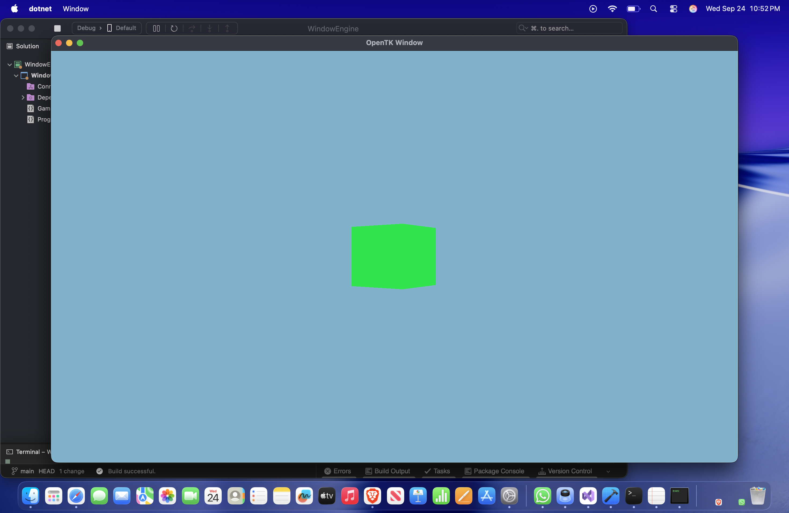

# Assignment 3: Rendering a 3D Cube
##  Overview
This project is a simple OpenGL setup using **C# with OpenTK**.  
It opens a blank window and renders a basic **3D rectangle** in the center of the screen.  

---

##  Library Used
- **[OpenTK](https://opentk.net/)** – a C# wrapper for OpenGL, OpenAL, and OpenCL, fully cross-platform (Windows, Linux, macOS).
 can be installed using NuGet in Visual Studio 2022.
- `Vector3`, `Matrix4`, and `Quaternion`
- Creating transformation matrices
- Rendering a rotating/scaling cube on screen

---

## Features
- **3D Cube Geometry** – 8 unique vertices, 12 triangles (36 indices).
- **Perspective Projection & View Matrix** – Proper 3D depth.
- **Depth Testing** – Ensures correct face ordering.
- **Transformations**
  - Automatic Y-axis rotation.
  - Dynamic scaling.

----

## Operations Implemented

### Vector Operations
- Addition: `v1 + v2`
- Subtraction: `v1 - v2`
- Dot Product: `Vector3.Dot(v1, v2)`
- Cross Product: `Vector3.Cross(v1, v2)`

###  Matrix Operations
- Identity Matrix: `Matrix4.Identity`
- Scaling: `Matrix4.CreateScale()`
- Rotation: `Matrix4.CreateRotationX()` 
- Multiplication: `combining scale * rotation to transform a point`

##  How to Run

### Prerequisites
- [.NET 7 or .NET 8 SDK](https://dotnet.microsoft.com/en-us/download)
- Visual Studio 2022 (with **.NET desktop development** workload)
- Git (to clone the repository)

---

### Using Visual Studio 2022 
- Clone the file using git clone or download the zip

#### Open the project:

- Launch Visual Studio 2022
- Go to File → Open → Project/Solution
- Select the .sln file inside the repo folder

#### Run the program:

- Press F5 (Debug mode) or Ctrl+F5 (Run without debugging)

- A window should appear with a green 3D cube in the center rotating

### Screenshot:

 
